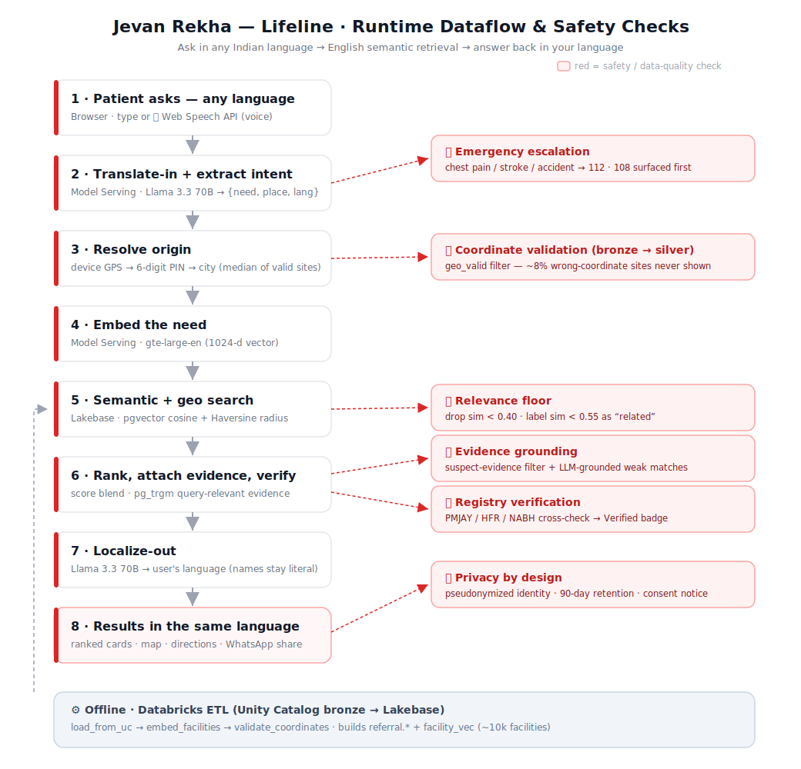

# Jevan Rekha — Lifeline

**Ask in your own language — type or speak _"पटना के पास डायलिसिस"_ — and get an evidence-attached shortlist of candidate health facilities, answered back in the same language.**

A Databricks hackathon app for social good: helping clinicians and patients in India find the right facility for a specific need, fast — in whatever language they speak. Built on **Databricks Apps** (AppKit / TypeScript), **Lakebase** (Postgres + pgvector), and **Databricks Model Serving** (foundation-model embeddings + a chat LLM for translation), over ~10k real facilities from the Unity Catalog lakehouse.

🔗 **Live app:** https://referral-copilot-2662815623088807.aws.databricksapps.com

---

## What it does

- 🗣️ **Conversational agent** — multi-turn chat with follow-ups ("what about Jaipur?", "any public ones?"); each turn keeps context.
- 🌐 **Any language, in and out** — type or speak in Hindi/Bengali/Tamil/… ; results come back in the same language. Facility names/phones stay literal.
- 🎯 **Semantic + geo ranking** — meaning-based match (pgvector) blended with distance, with **query-relevant evidence** cited on every card.
- 📍 **Precise "near me"** — device GPS, a 6-digit PIN, or a city — distances from *your* spot, not a city centroid.
- ✅ **Validated coordinates** — a bronze→silver pipeline flags facilities whose coordinates are wrong (≈8% of the source); bad ones never appear.
- 🏥 **Public/Private filter**, 🧭 **Directions** (Google Maps), and 📲 **WhatsApp share** on every result.
- 🛡️ **Healthcare guardrails** — emergency escalation (112/108), relevance floor, medical disclaimer, graceful degradation.
- 🔒 **Privacy by design** — pseudonymized identity, 90-day retention, consent notice.
- 💰 **Cost dashboard** — live, measured from real Model Serving token usage.

## Why it works

Lexical search misses the way care needs are actually phrased. Someone searching _"renal replacement therapy"_ should still find a hospital whose page says _"dialysis unit"_; _"open heart bypass"_ should surface _"CABG"_. Referral Copilot embeds the query and every facility with a foundation model and matches on **meaning**, then re-ranks by **proximity** and capacity, and attaches **evidence** — the specific procedures/capabilities that matched — so every recommendation is explainable.

```
"dialysis near Patna"
  → Patna Dialysis Centre · 0.9 km · sim 0.682 · "Performs dialysis treatment"
  → IGIMS                · 3.9 km · sim 0.472 · "Dialysis is provided at the IGIMS Dialysis Unit"

"open heart bypass surgery near New Delhi"
  → Delhi Heart & Lungs Institute · 5.0 km · "Cardiac surgery • Open-heart surgeries"
  → SSB Heart & Multispeciality   · 14.9 km · "Complex bypass surgery (CABG) • Coronary bypass"
```

## Architecture



The runtime is a single vertical pipeline — **translate-in → resolve origin → embed → search → rank/verify → localize-out** — with safety and data-quality **checks** (red) gating each stage, fed by an offline Databricks ETL that builds the `referral.*` tables and `facility_vec`.

```
 Browser                Databricks App (AppKit / Node + React)            Databricks platform
┌─────────┐   /ask     ┌───────────────────────────────────────┐
│🎤 / type │──────────► │ 1. translate-in + extract intent ─────┼──► chat LLM (Llama 3.3 70B)
│ any lang │            │ 2. geocode place ─────────────────────┼──► Lakebase (Postgres)
│         │            │ 3. embed need ────────────────────────┼──► Model Serving (gte-large-en)
│ results │ ◄───────── │ 4. search_facilities_vec(geo+cosine) ─┼──► Lakebase pgvector
│🔊 cards  │            │ 5. attach evidence (trgm)             │
│ in lang  │            │ 6. localize-out summary + evidence ───┼──► chat LLM
└─────────┘            └───────────────────────────────────────┘
                                                  ▲
 Unity Catalog bronze ──(ETL: etl/*.py)──► referral.* tables + facility_vec
```

### Multilingual — talk in your language

The retrieval core stays English; multilingual support wraps it: **translate in, search in English, translate out.**

1. **Translate-in + intent extraction** (one chat-LLM call): any language → `{ need, place, lang }` in English. Handles Devanagari (**डायलिसिस**), other Indian scripts, romanized ("Patna ke paas dialysis"), and code-mixed input. Pure-English `"<need> near <place>"` skips the LLM (fast path).
2. The **English pipeline runs unchanged** (geocode → embed → vector search → evidence).
3. **Localize-out** (one chat-LLM call): the summary and per-card evidence are translated back into the user's language; **facility names, phones, and URLs stay literal**. The detected English interpretation is echoed for confirmation ("understood as …").
4. **Voice** is browser-side (Web Speech API): mic for speech-to-text, read-aloud for text-to-speech — no serving endpoint, no cost.

This keeps a single English vector space (no re-embedding, no extra storage) and adds at most two LLM round-trips, only when the input isn't English.

- **Retrieval** is semantic: the query is embedded with `databricks-gte-large-en` (1024-d), matched against `referral.facility_vec` via pgvector cosine distance combined with a Haversine geo radius in a single SQL function (`referral.search_facilities_vec`). Results are scored `0.60·similarity + 0.25·proximity + 0.10·beds + 0.05·doctors`.
- **Evidence** is query-relevant: after ranking, the route picks the procedures/capabilities/specialties most similar to the need (via `pg_trgm`) so each card cites _why_ it matched.
- **Location** resolves to the most precise origin available — **device GPS → 6-digit PIN → city** — geocoded from the **median of validated facilities** (the India-Post pincode directory is ignored; thousands of its centroids land in the wrong state). GPS only wins when it's near the named place, so "what about Jaipur?" from a Patna phone still uses Jaipur.

## Tech stack

| Layer | Tech |
|---|---|
| App | Databricks Apps, AppKit (`@databricks/appkit`), React + Vite, Express, Zod |
| OLTP + vectors | Lakebase Autoscaling Postgres 17, `pgvector`, `pg_trgm` |
| Embeddings | Databricks Model Serving — `databricks-gte-large-en` |
| Translation / localization | Databricks Model Serving — `databricks-meta-llama-3-3-70b-instruct` |
| Voice | Browser Web Speech API (STT + TTS), client-side |
| Data | Unity Catalog bronze tables, Serverless SQL warehouse, `psql \copy` ETL |
| Bundle | Databricks Asset Bundle (`databricks.yml`) |

## API

| Endpoint | Purpose |
|---|---|
| `POST /api/conversation` · `…/:id/message` · `…/:id/close` | Multi-turn agent: start, send a turn (text/PIN/GPS, public/private), close (archives + purges) |
| `GET /api/referral/ask?q=&radius=&lat=&lng=` | Single-shot NL entry: parse → resolve origin (GPS/PIN/city) → semantic search → localize |
| `GET /api/referral/search?need=&lat=&lng=&radius=` | Semantic search with explicit coordinates |
| `GET /api/referral/facility/:id` | Full evidence for one facility (specialties, procedures, capabilities, sources) |
| `POST/GET /api/referral/shortlists`, `…/items`, `PATCH …/items/:id` | Save and triage candidate facilities |
| `GET /api/cost` | Measured token cost + compute estimate for the cost dashboard |

## Project structure

```
client/src/pages/
  ChatPage.tsx          Multi-turn agent UI (mic, GPS, filter, directions, WhatsApp)
  ReferralSearchPage.tsx  Single-shot NL search
  CostPage.tsx          Live cost dashboard
  ShortlistPage.tsx     Saved/triaged facilities
server/
  server.ts             AppKit app: lakebase() + serving() + server() plugins
  routes/referral/
    search-core.ts      Shared core: embed, chat LLM, intent parse, localize, origin, search, guardrails
    referral-routes.ts  /ask, /search, facility detail, shortlist CRUD
    conversation-routes.ts  Multi-turn agent + archive-to-UC + retention sweep
    cost-routes.ts      /api/cost (measured token usage × prices)
    user.ts             Pseudonymous (salted-hash) identity
    schema.ts           Lakebase DDL (runs in onPluginsReady; SP owns the schema)
etl/
  load_from_uc.py            UC bronze → referral.* (psql \copy, TEXT format)
  embed_facilities.py        embed via ai_query → facility_vec + search_facilities_vec
  validate_coordinates*.py   bronze→silver coordinate validation (internal + OpenStreetMap)
databricks.yml          Asset Bundle: app + Lakebase + serving_endpoint resources (embed + llm)
app.yaml                Runtime command + env injection (valueFrom resources)
```

## Data dictionary (`referral.*` in Lakebase)

These descriptions are also stored as Postgres `COMMENT`s (see [`db/comments.sql`](db/comments.sql)), so they show in the Lakebase UI. Tables owned by the app Service Principal get their comments applied on deploy (`server/routes/referral/schema.ts`).

| Table | Rows | Description |
|---|--:|---|
| `facility` | ~10k | Master record — one row per facility. What every search returns. |
| `facility_capability` | 223k | Clinical capabilities (e.g. "dialysis unit"). Feeds embeddings + evidence. |
| `facility_procedure` | 156k | Procedures offered (e.g. "CABG"). Feeds embeddings + evidence. |
| `facility_specialty` | 118k | Medical specialties. Feeds embeddings + evidence. |
| `facility_phone` | 40k | Phone numbers per facility (`is_official` flag). |
| `facility_source_url` | 153k | Provenance — source URLs per fact. |
| `facility_vec` | ~10k | 1024-d `pgvector` embeddings — the semantic search index. |
| `facility_geo` | 9.9k | Runtime `geo_valid` filter + distance; search joins on this. |
| `facility_validated` | 9.9k | Silver coordinate-validation audit (offline; syncs into `facility_geo`). |
| `facility_verification` | 89 | Registry matches (PMJAY/NABH/HFR) → the **Verified** badge. |
| `registry_stage` | 1.3k | Transient staging for the verification ETL (rebuilt each run). |
| `pin_geo` | 20k | PIN → district/centroid lookup. **Deprecated** (wrong centroids); reference only. |
| `conversation` | — | One row per chat session; archived to UC + purged on close/idle. |
| `conversation_turn` | — | Chat messages; `results_json` snapshots returned facilities. |
| `search_session` | — | Single-shot search log (analytics + retention sweep). |
| `shortlist` / `shortlist_item` | — | Saved lists. **Dormant** — backed the removed "My referrals" UI. |
| `usage_event` | — | One row per Model Serving call (real token usage) — the cost dashboard's source. |

## Local development

Prereqs: Node 20+, the [Databricks CLI](https://docs.databricks.com/dev-tools/cli/), `psql`, and a workspace profile (`databricks auth login --profile <name>`).

```bash
cp .env.example .env          # fill in host, Lakebase endpoint/host, serving endpoint
npm install
npm run dev                   # http://localhost:8000 (tsx watch)
# or run the production build:
npm run build && npm run start
```

Auth uses your CLI profile. If the app's SDK init can't pick up the profile token, start with an explicit token:

```bash
DATABRICKS_TOKEN=$(databricks auth token --profile <name> | python3 -c "import json,sys;print(json.load(sys.stdin)['access_token'])") npm run start
```

## Build the data (one time)

```bash
python3 etl/load_from_uc.py        # UC bronze → referral.* (~10k facilities)
python3 etl/embed_facilities.py    # embeddings → facility_vec + search function
```

## Deploy

```bash
databricks apps deploy --auto-approve   # build + typecheck + lint, deploy, run
```

The Service Principal owns the `referral` schema (deploy-first ownership), so `server/routes/referral/schema.ts` runs the DDL on startup. The bundle grants the SP `CAN_QUERY` on the serving endpoint and `CAN_CONNECT_AND_CREATE` on Lakebase.

## Data sources

Unity Catalog bronze (`dais_hackathon.bronze`):
- `bronze_facilities` — facility directory (name, type, capacity, specialties/procedures/capabilities, contact, coordinates)
- `bronze_india_post_pincode_directory` — PIN → district/state + centroids (geocoding fallback)
- `bronze_nfhs_5_district_health_indicators` — district health indicators (context)

## Conversational agent & ephemeral storage

The chat is the primary surface. A conversation lives in Lakebase (`referral.conversation` / `conversation_turn`) while active — fast OLTP for low-latency turns — then on **close or 30-min idle** it's **archived to a UC Delta table** (`dais_hackathon.bronze.rc_conversations`) and **purged from Lakebase**, keeping the OLTP store lean while history lands in the lakehouse. Follow-ups inherit the prior turn's need/place so "what about Jaipur?" just works.

## Data quality — coordinate validation (bronze → silver)

≈8% of source coordinates are wrong (a "Noida" hospital plotted 500 km away). `etl/validate_coordinates_lakebase.py` builds a **silver** validation layer with two stages:

1. **Internal consistency** (free, instant): inside India and within 80 km of the robust median of its own city.
2. **OpenStreetMap / Nominatim** (free, optional): geocode the address; the stored point must be within 15 km.

The resulting `geo_valid` flag is what the search filters on — bad-coordinate facilities never appear, and they're excluded from origin geocoding too.

## Registry verification

`etl/verify_facilities.py` entity-resolves facilities against official registries (**PMJAY / HFR / NABH**) — fuzzy-matching on name + PIN/city — and writes matches to `referral.facility_verification`. When a result is matched, the UI shows a green **Verified** badge with the source (e.g. `PMJAY`). The thresholds (`PIN_THRESHOLD`, `CITY_THRESHOLD`) are tuned to avoid false positives.

**Real source data, ingested from the official Govt. of Haryana AB-PMJAY portal.** `etl/ingest_pmjay_haryana.py` pulls the district-wise empanelled-hospital PDFs from <https://ayushmanbharat.haryana.gov.in/pm-jay/> (all 22 districts, **1,329 hospitals**) and writes them to `data/registry/pmjay_haryana.csv`. Running the verification pipeline against this plus the Patna/Jaipur seed (`data/registry/sample.csv`) currently verifies **89 facilities** (87 PMJAY + 2 NABH) — try **"hospital in Karnal"**, **"surgery in Faridabad"**, or **"dialysis in Patna"** to see the badge. Coverage grows by ingesting more states the same way (each state publishes the same district-PDF format).

## Guardrails (healthcare)

- **Emergency escalation** — emergency intent (chest pain, stroke, accident… in multiple languages) surfaces **112 / 108** ambulance buttons first.
- **Relevance floor** — results below 40% similarity are dropped; below 55% are labelled "related", so a weak match never looks strong.
- **Medical disclaimer** — persistent "informational only, not medical advice" notice.
- **Graceful degradation** — LLM down → fall back to regex/English; DB asleep → friendly "waking up" message, not a silent failure.

## Privacy & retention

- **Pseudonymized identity** — the raw email is never stored; a salted SHA-256 pseudonym is (`server/routes/referral/user.ts`).
- **Retention** — `conversation` and `search_session` rows are hard-deleted after `RETENTION_DAYS` (default 90).
- **Consent** — the UI states data is stored pseudonymously and auto-deleted.

## Cost & observability

- **Cost dashboard** (`/cost`) — embedding/LLM token costs are **measured** from `referral.usage_event` (real tokens logged per Model Serving call); compute is an editable estimate (`PRICE_*` env vars).
- **Observability** — app logs via `databricks apps logs`; structured app traces in Lakebase (`usage_event`, `search_session`, conversations); platform traces in `system.serving` / `system.billing` / `system.access` (needs a SQL warehouse to query).

## Implementation notes

- **512 MB free-trial Lakebase cap.** The schema is kept lean to fit: redundant tables and the older lexical full-text matview/trigram indexes are dropped on deploy (the Service Principal drops its own objects in `onPluginsReady`). Current footprint ≈ 336 MB.
- **No HNSW index** on the vectors — it didn't fit the cap, and a sequential cosine scan over ~10k vectors is sub-100 ms. Re-add `USING hnsw (embedding vector_cosine_ops)` on a larger tier for scale.
- **Two serving endpoints.** `embed` (`EMBED_ENDPOINT`) for query embeddings and `llm` (`LLM_ENDPOINT`) for translation, both injected from `serving_endpoint` bundle resources. `DATABRICKS_SERVING_ENDPOINT_NAME` is also set (to the embed endpoint) to satisfy the serving plugin's required default-endpoint check.
- **Translate-in / search-English / translate-out.** Multilingual support wraps the English retrieval core rather than replacing the embeddings, so the vector DB and ETL are unchanged.

---

Built with [Databricks AppKit](https://databricks.github.io/appkit/).
